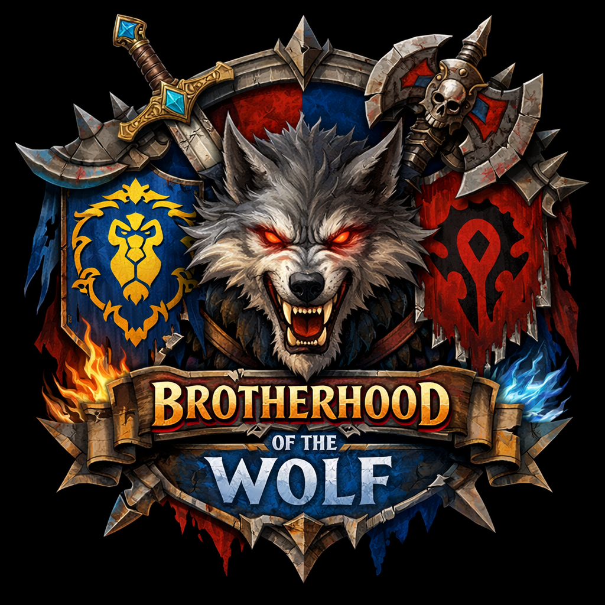

# 🐺 Brotherhood of the Wolf — Guild Council

Welcome to the **Brotherhood of the Wolf** guild council repository. This is where our council members document meeting notes, share decisions, and coordinate the guild's strategic direction.

## 📋 Council Meeting Notes

All council meetings are documented here. Council members can contribute and share updates:

- [April 2026 Council Meeting](meetings/2026-april/index.html)

## About the Brotherhood of the Wolf

The **Brotherhood of the Wolf** is a community-focused World of Warcraft guild built on structure, respect, and collective growth. We are not just players logging in to raid—we are a pack that moves together.

### Our Identity

- **Community-First**: We prioritize genuine connection and belonging over raw performance.
- **Mixed Approach**: We balance both PvE (Raids, Mythic+) and PvP (Arena, RBG) activities.
- **Semi-Core Philosophy**: We are ambitious but relaxed—we want to excel without burning out.
- **Performance Without Toxicity**: We strive for progression while maintaining a respectful, solution-oriented culture.

### What We Do Together

- ⚔️ **Raids & Mythic+**: Structured PvE progression with clear leadership and goal-setting
- 🏟️ **PvP & Arenas**: Competitive Arena and RBG teams with dedicated coaching
- 🎭 **Events & Transmog Runs**: Social bonding, achievement hunts, and fun content
- 🎙️ **Voice & Community**: Our Discord voice channel is the heartbeat of the pack
- 📈 **Growth Together**: Shared character development, mentorship, and skill building

### The Structure: Three Pillars

Our guild operates on a clear three-tier structure designed to support both leadership and action:

1. **🐺 Team-Leads** — Provide direction, vision, and overarching strategy
2. **⚔️ Support** — Execute decisions, manage sub-areas, and drive recruitment
3. **🛡️ Council** — Coordinate activities, foster community, and keep everyone connected

The guild's philosophy is simple: **"Struktur ohne Druck"** (Structure without Pressure). We have a framework that works, but we don't burden people with unnecessary stress.

### Leadership & Roles

#### **Community**
- **Marc** — Alpha of the Pack; Oversees guild systems, identity, housing, and overall vision
- **Lisa** — Vice & Voice of the Pack; Leads recruiting, guild bank management, messaging
- **Marco** — Integration Lead; Welcomes and onboards new members
- **Bizzy** — Keeper of Legends; Organizes achievement runs and cultural events

#### **PvE**
- **Marco** — PvE Strategist; Aligns M+ and raid direction, character development
- **Fabi** — Raid Master; Handles raid composition, setup, execution, and raider recruitment
- **Malte** — M+ Warden; Organizes mythic+ groups, key progression, and M+ recruitment

#### **PvP**
- **Alex** — Warlord of the Pack; Leads PvP vision, arena, and RBG organization
- **Bizzy** — PvP Mentor & Support; Coaches new PvP players and fosters group activity
- **Fabi** — PvP Support; Assists with arena matchmaking and recruitment

### Core Values & Expectations

**What We Expect From Council Members:**

- 🎙️ **Voice Active** — Be present in voice; it's our gathering place
- 🔥 **Create Activity** — Start groups, invite players, make the first move
- 📋 **Plan Ahead** — Think a week forward, not just today
- 🐺 **Pack Mentality** — We move together, always

**Core Philosophy:**  
*"Aktivität wird geschaffen — nicht abgewartet."*  
(Activity is created—not waited for.)

### Who We Seek

We look for:
- Respectful, calm, solution-oriented players
- People who want to belong to a true community
- Motivated teammates who value fun over ego
- Team-first mindset, no drama, no toxicity

## 🤝 Contributing to Council Notes

All council members can contribute to this repository:

1. Attend council meetings or add notes from your area
2. Document decisions and action items
3. Share updates on recruiting, events, and progression
4. Keep the community informed

**Remember**: This is a living document. Keep it updated, clear, and accessible.

---

**Note:** This repository and documentation were parcially generated by GitHub Copilot AI.

*"Wir warten nicht. Wir folgen keinem Chaos. Wir bauen das Rudel."*  
(We don't wait. We follow no chaos. We build the pack.)
